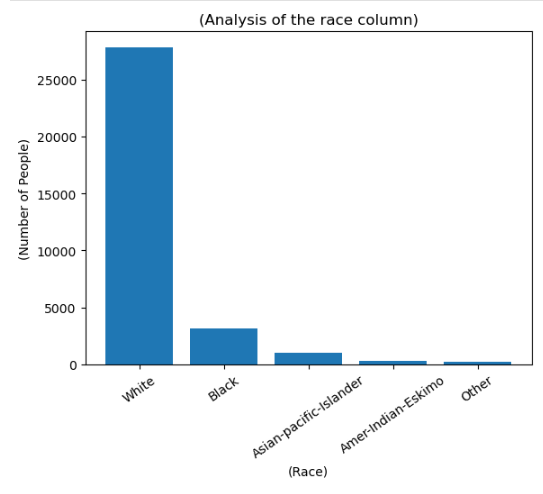
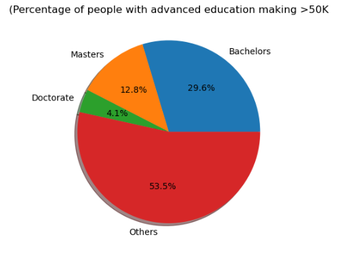
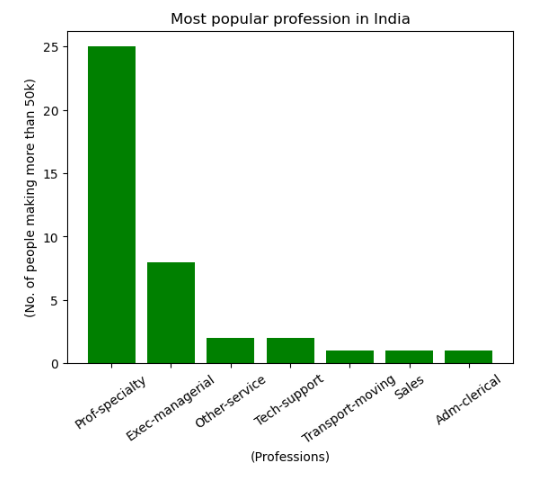

# **📊Demographic Data Analyzer**

📄 **Description:**
This project analyzes demographic data using the Pandas library and visualizations are represented in the form of bar and pie chart using Matplotlib. 
The dataset used is extracted from 1994 census (source of the dataset is given below). 
The dataset contains information on various demographic factors such as age, education, salary, country, occupation, etc.

## **📈Key insights after analyzing the dataset:**

👥**People of each race represented in the Dataset** :-

1) Number of white people:- 27816

2) Number of black people:- 3124

3) Number of Asian-Pac-Islander people:- 1039

4) Number of Amer-Indian-Eskimo people:- 311

5) Number of other people:- 271

Representation using Bar Graph :

🎓 **The percentage of people who have a Bachelor's degree** :- 16.446%

🚹 **The average age of men** :- 39.433 years

🕑 **Minimum number of hours a person works** :- 1 hrs / week

🕘 **Maximum number of hours a person works** :- 99 hrs / week

📜**Percentage of people with advanced education (Bachelors, Masters or Doctorate combined) make more than 50K** :- 46.536%

(Bachelors, Masters and Doctorate % are indivisually represented using pie diagram) :

🎓 **Number of people without advanced education making more than 50K** :- 4355

⏳ **Percentage of people who work the mininmum number of hour per week and have a salary of more than 50K** :- 0.006 %

📊 **The most popular occupation in India in which people are making more than 50K :-** Prof-specialty

(Representation using Bar Graph) :

💰Country that has the highest percentage of people that earns \>50K is **United-States.** Percentage is **91.455%** (for only \>50K salary) and **22.023%** (for both \>50k and \<=50K combined).

## **📑Data Source :**

Dua, D. and Graff, C. (2019). UCI Machine Learning Repository.
